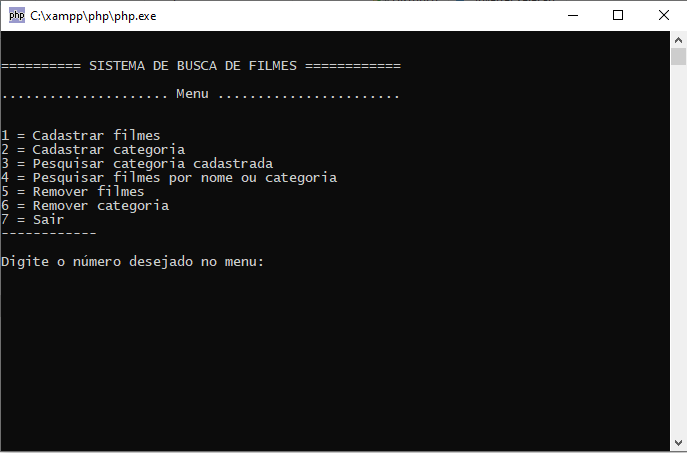

# Teste para vaga de desenvolvedora júnior

## Objetivo:
Desenvolver um sistema para cadastro de filmes com categorias, cadastro de categoria sem  o filme, pesquisa de categoria, pesquisa de filme por categoria ou por nome, excluir filme e categoria.




## Cenários possíveis de fazer no sistema:

#### Cadastro de filme


* Cadastro de filme.
* Cadastro de categoria 1 ou mais.


#### Cadastro categoria


* Cadastro de categoria.

#### Pesquisa de categorias cadastradas


* Resultado de todas as categoria cadastrada com relação ao termo pesquisado.


#### Pesquisa de filmes por nome ou categoria


* Pesquisa por nome com resultado(s) de filme(s) cadastrado(s).
* Pesquisa por categoria com resultado(s) de filme(s) cadastrado(s).


#### Remover filme


* Remover o filme e categoria associado.


#### Remover categoria

* Remover categoria que não tem filme(s) associado(s).
* Não remove categoria associado 1 ou mais filmes.


## Requisitos

* PHP 7.X
  * Testado no PHP 7.4.7
* MySQL

## Árvore de pasta do projeto:

```bash
|---  class
|     | banco.php
|     | readme.md
|
|---  function
|     | readline.php
|
|---  connection
|     | conexao.php
|
|---  controller
|     | cadastrar_cat.php
|     | cadastrar_filmes.php
|     | excluir_cat.php
|     | excluir_filme.php
|     | pesquisar_cat.php
|     | pesquisar_filmes.php
|     | fim_execucao.php
|
|---  views
|     | cadastrar-categoria.php
|     | cadastar-filmes.php
|     | pesquisar-filmes.php
|     | pesquisar-por-categoria.php
|     | remover-categoria.php
|     | remover-filmes.php
|     | sair.php
| 
| menu.php
| readme.md
| start.bat (arquivo opcional Windows -> podendo editar o caminho no .bat)
| start.sh (arquivo opcional Linux -> podendo editar o caminho)

```
__start.bat__ neste arquivo você deve colocar o endereço do caminho do intepretador.

```bash
echo off
start C:\xampp\php\php.exe menu.php'
```
__start.sh__ neste arquivo você deve colocar o endereço do caminho do intepretador, para ficar fácil abertura do mesmo.


## Menu documentações dos arquivos separadamente.

- [Readme de todas as Class e Métodos disponível no sistema.](https://github.com/davinyvidal/teste-desenvolvedora-junior/blob/master/class/readme.md)
- [Readme do controller < regra de negócio > ](https://github.com/davinyvidal/teste-desenvolvedora-junior/blob/master/controller/readme.md)


## Diagrama do banco de dados


```bash
id (categorias) ->> id_categoria (filmes)
```

## Instalação 

- Instalação do PHP

Primeiro você deve ter o PHP e MYSQL instalado, para facilitar, ultiliza o [Xampp, link externo](https://www.apachefriends.org/download.html)

Depois de instalar, vamos rodar SQL para criar as tabelas e banco, caso você não criou o banco no gerenciado do phpmyadmin do Xampp.

- SQL para criar o banco e tabela:

Script SQL para criação do banco:

Em algum casos o banco e criado no sistema de gerenciamento, neste caso vefirique se já tem um banco criado

```bash
CREATE DATABASE `filmesDB`;

```

SQL de criação das tabelas:

```bash
CREATE TABLE `categorias` (
 	 `id` INT(10) NOT NULL AUTO_INCREMENT,
 	 `nome_categoria` VARCHAR(50) NOT NULL,
 	 `quantidade` INT(10) DEFAULT NULL,
  PRIMARY KEY (`id`) USING BTREE
);


CREATE TABLE `filmes` (
 	 `id` int(10) NOT NULL AUTO_INCREMENT,
 	 `nome_filme` VARCHAR(255) NOT NULL,
 	 `id_categoria` INT(11) NOT NULL,
 	 PRIMARY KEY (`id`) USING BTREE,
	 KEY `FK_filmes_categorias` (`id_categoria`),
 	 CONSTRAINT `FK_filmes_categorias` FOREIGN KEY (`id_categoria`) REFERENCES `categorias` (`id`) ON UPDATE CASCADE
);
```

- Configuração do banco de dados:

  - /conexao/conexao.php

Local com as variáveis para conexão com Banco de dados
```bash
$servidor = ""; # nome do servidor
$usuario = "";  # nome do usuario do banco de dados
$senha = ""; # senha do banco de 
$dbname = ""; # nome do banco de dados -> se você usou o script desta página o banco é filmesDB.

```
- Configuração do endereço do projetos:
 no arquivo menu.php mude o termo < local que deve ficar o endereço > para o local real do projeto no seu computador, veja um exemplo como era o endereço real no meu computador.
/menu.php

```bash
$dir_projetc ="<local que deve ficar o endereço>"
```

Exemplo:
```bash
$dir_projetc ="I:\Github\teste-desenvolvedora-junior"
```
__Obs__ não colocar o \ no final do endereço.

## Lincença:

#### Licença Pública Geral GNU v3.0
As permissões desta licença copyleft forte estão condicionadas a disponibilizar o código fonte completo das obras e modificações licenciadas, que incluem obras maiores usando uma obra licenciada, sob a mesma licença. Os avisos de direitos autorais e licença devem ser preservados. Os colaboradores fornecem uma concessão expressa de direitos de patente.

#### Considerações finais
Sistema feito 💜 pela Daviny Vidal.

Github @davinyvidal

Repositório Github @daninyvidal/teste-desenvolvedora-junior